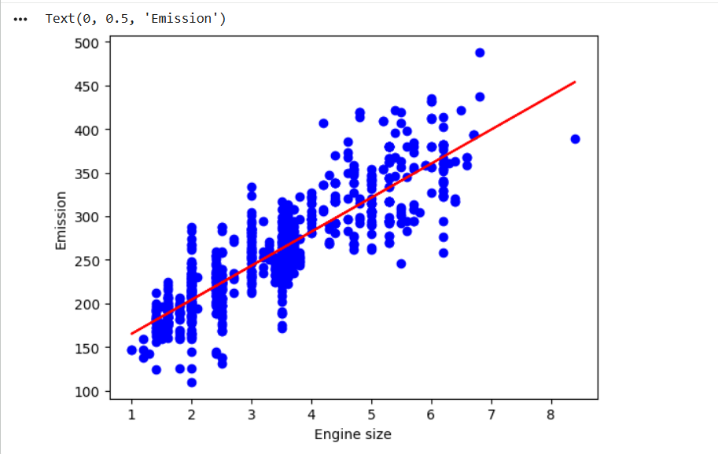
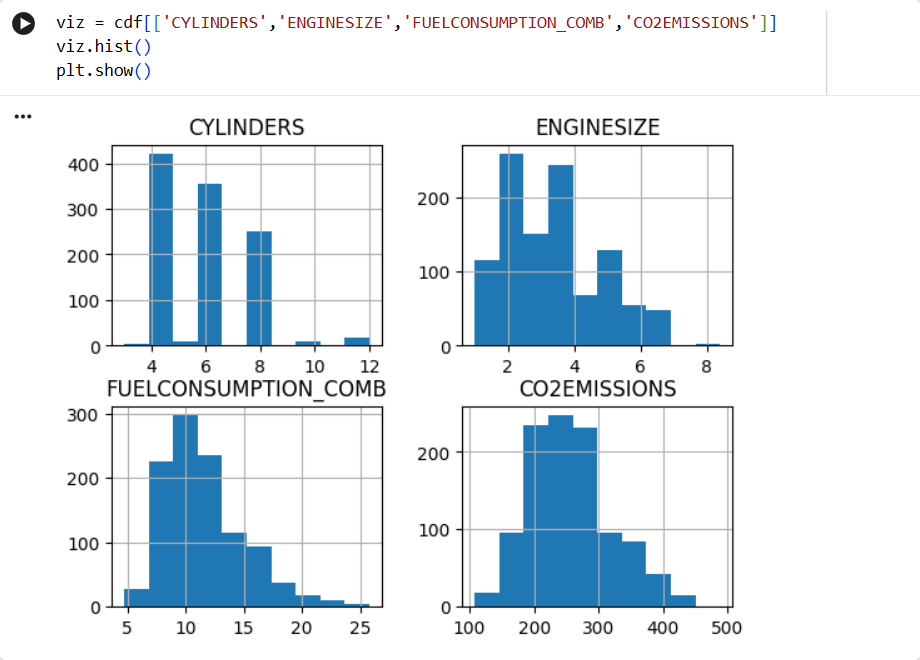
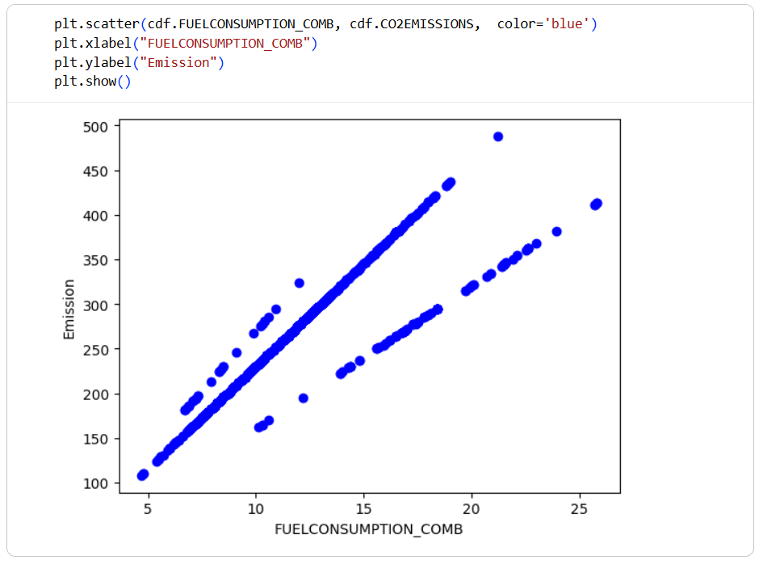
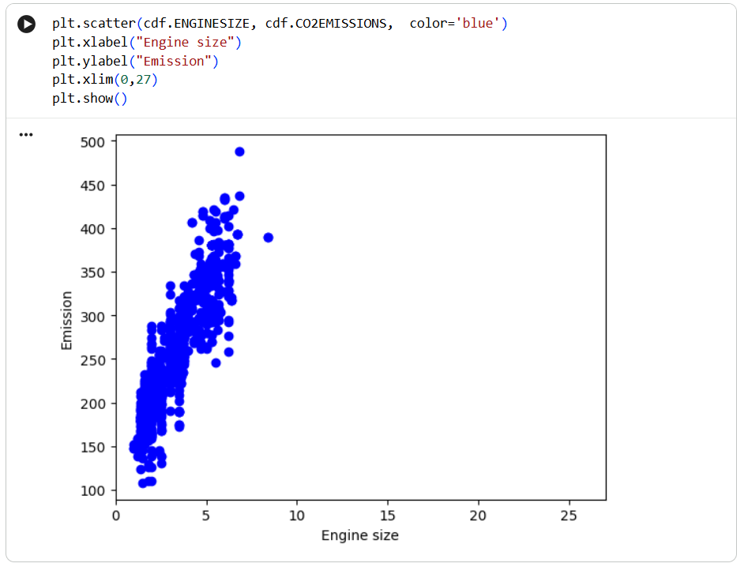
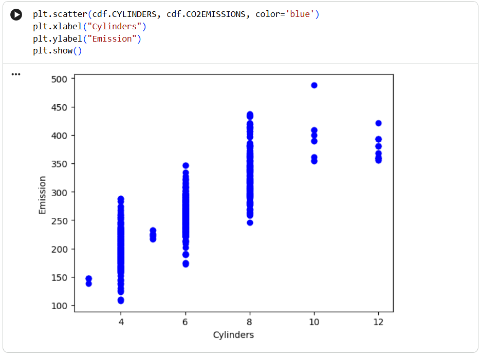

# Simple Linear Regression — CO2 Emissions

## 🎯 Problem
Predict **CO2 emissions** of cars using a single feature (**engine size**).

## ⚙️ Approach
- Data exploration (Pandas, Matplotlib)
- Visualize relationships (scatter plots)
- Train **Linear Regression** model (scikit-learn)
- Evaluate with **MAE, MSE, R²**

## 📊 Results
- R² ≈ 0.76 → the model explains ~76% of the variance
- MAE ≈ 24 → average prediction error

## 🧠 Key Insight
Linear Regression learns a **line (y = a + bx)** that best fits the data and enables **numeric prediction**.

## 🧩 QCare Mapping
This concept can power a **scoring engine**:
- Input: product/user features  
- Output: **suitability score (0–1)**  
- LLM then **explains** the score to the user

## 🚀 How to Run
1. Open in Google Colab  
2. Run all cells  
3. View plots and metrics

## 🛠️ Tech Stack
Python, Pandas, NumPy, Matplotlib, Scikit-learn

## 📌 Note
This project is based on an IBM Machine Learning lab and extended with my own understanding and mapping to real systems.

## Model Visualization

## Visualizations

### 1. Data Distribution (Histogram)

### 2. Fuel Consumption vs CO2

### 3. Engine Size vs CO2

### 4. Cylinders vs CO2

### 5. Final Model (Regression Line)

